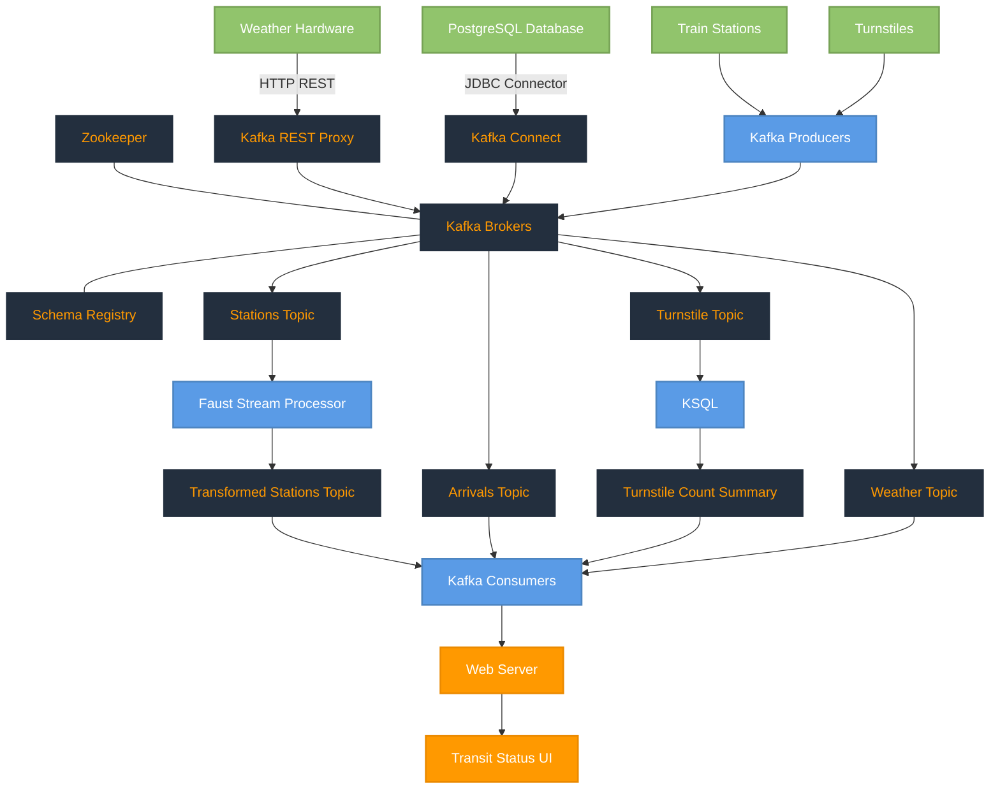

# Public Transit Status with Apache Kafka

In this project, you will construct a streaming event pipeline around Apache Kafka and its ecosystem. Using public data from the [Chicago Transit Authority](https://www.transitchicago.com/data/) we will construct an event pipeline around Kafka that allows us to simulate and display the status of train lines in real time.

When the project is complete, you will be able to monitor a website to watch trains move from station to station.


## Prerequisites

The following are required to complete this project:

* Docker
* Python 3.7
* Access to a computer with a minimum of 16gb+ RAM and a 4-core CPU to execute the simulation

## Description

The Chicago Transit Authority (CTA) has asked us to develop a dashboard displaying system status for its commuters. We have decided to use Kafka and ecosystem tools like REST Proxy and Kafka Connect to accomplish this task.

Our architecture will look like so:

## Architecture


This Mermaid diagram illustrates the complete architecture of the Chicago Transit Authority (CTA) public transportation optimization project. Let me explain each component:

### Data Sources

PostgreSQL Database: Contains station information that is extracted using Kafka Connect
Weather Hardware: Sends weather data via HTTP REST to Kafka REST Proxy
Train Stations: Generate arrival events using Kafka producers
Turnstiles: Generate turnstile events using Kafka producers

### Kafka Infrastructure

Zookeeper: Manages the Kafka cluster
Kafka Brokers: The core messaging system that handles all data streams
Schema Registry: Stores and validates Avro schemas for the data
Kafka REST Proxy: Accepts HTTP requests from the weather hardware
Kafka Connect: Extracts data from PostgreSQL into Kafka topics

### Kafka Topics

Stations Topic: Contains raw station data from PostgreSQL
Arrivals Topic: Contains train arrival events
Turnstile Topic: Contains turnstile events
Weather Topic: Contains weather data
Transformed Stations Topic: Contains processed station data

### Stream Processing

Faust Stream Processor: Transforms the raw station data into a more usable format
KSQL: Aggregates turnstile data into summary counts

### Consumers and UI

Kafka Consumers: Consume data from all relevant topics
Web Server: Serves the transit status pages
Transit Status UI: Displays real-time transit information to commuters

This architecture enables real-time processing of transit data from multiple sources, allowing commuters to see up-to-date information about train arrivals, station status, and weather conditions.

### Step 1: Create Kafka Producers
The first step in our plan is to configure the train stations to emit some of the events that we need. The CTA has placed a sensor on each side of every train station that can be programmed to take an action whenever a train arrives at the station.

To accomplish this, you must complete the following tasks:

1. Complete the code in `producers/models/producer.py`
1. Define a `value` schema for the arrival event in `producers/models/schemas/arrival_value.json` with the following attributes
	* `station_id`
	* `train_id`
	* `direction`
	* `line`
	* `train_status`
	* `prev_station_id`
	* `prev_direction`
1. Complete the code in `producers/models/station.py` so that:
	* A topic is created for each station in Kafka to track the arrival events
	* The station emits an `arrival` event to Kafka whenever the `Station.run()` function is called.
	* Ensure that events emitted to kafka are paired with the Avro `key` and `value` schemas
1. Define a `value` schema for the turnstile event in `producers/models/schemas/turnstile_value.json` with the following attributes
	* `station_id`
	* `station_name`
	* `line`
1. Complete the code in `producers/models/turnstile.py` so that:
	* A topic is created for each turnstile for each station in Kafka to track the turnstile events
	* The station emits a `turnstile` event to Kafka whenever the `Turnstile.run()` function is called.
	* Ensure that events emitted to kafka are paired with the Avro `key` and `value` schemas

### Step 2: Configure Kafka REST Proxy Producer
Our partners at the CTA have asked that we also send weather readings into Kafka from their weather hardware. Unfortunately, this hardware is old and we cannot use the Python Client Library due to hardware restrictions. Instead, we are going to use HTTP REST to send the data to Kafka from the hardware using Kafka's REST Proxy.

To accomplish this, you must complete the following tasks:

1. Define a `value` schema for the weather event in `producers/models/schemas/weather_value.json` with the following attributes
	* `temperature`
	* `status`
1. Complete the code in `producers/models/weather.py` so that:
	* A topic is created for weather events
	* The weather model emits `weather` event to Kafka REST Proxy whenever the `Weather.run()` function is called.
		* **NOTE**: When sending HTTP requests to Kafka REST Proxy, be careful to include the correct `Content-Type`. Pay close attention to the [examples in the documentation](https://docs.confluent.io/current/kafka-rest/api.html#post--topics-(string-topic_name)) for more information.
	* Ensure that events emitted to REST Proxy are paired with the Avro `key` and `value` schemas

### Step 3: Configure Kafka Connect
Finally, we need to extract station information from our PostgreSQL database into Kafka. We've decided to use the [Kafka JDBC Source Connector](https://docs.confluent.io/current/connect/kafka-connect-jdbc/source-connector/index.html).

To accomplish this, you must complete the following tasks:

1. Complete the code and configuration in `producers/connectors.py`
	* Please refer to the [Kafka Connect JDBC Source Connector Configuration Options](https://docs.confluent.io/current/connect/kafka-connect-jdbc/source-connector/source_config_options.html) for documentation on the options you must complete.
	* You can run this file directly to test your connector, rather than running the entire simulation.
	* Make sure to use the [Landoop Kafka Connect UI](http://localhost:8084) and [Landoop Kafka Topics UI](http://localhost:8085) to check the status and output of the Connector.
	* To delete a misconfigured connector: `CURL -X DELETE localhost:8083/connectors/stations`

### Step 4: Configure the Faust Stream Processor
We will leverage Faust Stream Processing to transform the raw Stations table that we ingested from Kafka Connect. The raw format from the database has more data than we need, and the line color information is not conveniently configured. To remediate this, we're going to ingest data from our Kafka Connect topic, and transform the data.

To accomplish this, you must complete the following tasks:

1. Complete the code and configuration in `consumers/faust_stream.py

#### Watch Out!

You must run this Faust processing application with the following command:

`faust -A faust_stream worker -l info`

### Step 5: Configure the KSQL Table
Next, we will use KSQL to aggregate turnstile data for each of our stations. Recall that when we produced turnstile data, we simply emitted an event, not a count. What would make this data more useful would be to summarize it by station so that downstream applications always have an up-to-date count

To accomplish this, you must complete the following tasks:

1. Complete the queries in `consumers/ksql.py`

#### Tips

* The KSQL CLI is the best place to build your queries. Try `ksql` in your workspace to enter the CLI.
* You can run this file on its own simply by running `python ksql.py`
* Made a mistake in table creation? `DROP TABLE <your_table>`. If the CLI asks you to terminate a running query, you can `TERMINATE <query_name>`


### Step 6: Create Kafka Consumers
With all of the data in Kafka, our final task is to consume the data in the web server that is going to serve the transit status pages to our commuters.

To accomplish this, you must complete the following tasks:

1. Complete the code in `consumers/consumer.py`
1. Complete the code in `consumers/models/line.py`
1. Complete the code in `consumers/models/weather.py`
1. Complete the code in `consumers/models/station.py`

### Documentation
In addition to the course content you have already reviewed, you may find the following examples and documentation helpful in completing this assignment:

* [Confluent Python Client Documentation](https://docs.confluent.io/current/clients/confluent-kafka-python/#)
* [Confluent Python Client Usage and Examples](https://github.com/confluentinc/confluent-kafka-python#usage)
* [REST Proxy API Reference](https://docs.confluent.io/current/kafka-rest/api.html#post--topics-(string-topic_name))
* [Kafka Connect JDBC Source Connector Configuration Options](https://docs.confluent.io/current/connect/kafka-connect-jdbc/source-connector/source_config_options.html)

## Directory Layout
The project consists of two main directories, `producers` and `consumers`.

The following directory layout indicates the files that the student is responsible for modifying by adding a `*` indicator. Instructions for what is required are present as comments in each file.

```
* - Indicates that the student must complete the code in this file

├── consumers
│   ├── consumer.py *
│   ├── faust_stream.py *
│   ├── ksql.py *
│   ├── models
│   │   ├── lines.py
│   │   ├── line.py *
│   │   ├── station.py *
│   │   └── weather.py *
│   ├── requirements.txt
│   ├── server.py
│   ├── topic_check.py
│   └── templates
│       └── status.html
└── producers
    ├── connector.py *
    ├── models
    │   ├── line.py
    │   ├── producer.py *
    │   ├── schemas
    │   │   ├── arrival_key.json
    │   │   ├── arrival_value.json *
    │   │   ├── turnstile_key.json
    │   │   ├── turnstile_value.json *
    │   │   ├── weather_key.json
    │   │   └── weather_value.json *
    │   ├── station.py *
    │   ├── train.py
    │   ├── turnstile.py *
    │   ├── turnstile_hardware.py
    │   └── weather.py *
    ├── requirements.txt
    └── simulation.py
```

## Running and Testing

To run the simulation, you must first start up the Kafka ecosystem on their machine utilizing Docker Compose.

```%> docker-compose up```

Docker compose will take a 3-5 minutes to start, depending on your hardware. Please be patient and wait for the docker-compose logs to slow down or stop before beginning the simulation.

Once docker-compose is ready, the following services will be available:

| Service | Host URL | Docker URL | Username | Password |
| --- | --- | --- | --- | --- |
| Public Transit Status | [http://localhost:8888](http://localhost:8888) | n/a | ||
| Landoop Kafka Connect UI | [http://localhost:8084](http://localhost:8084) | http://connect-ui:8084 |
| Landoop Kafka Topics UI | [http://localhost:8085](http://localhost:8085) | http://topics-ui:8085 |
| Landoop Schema Registry UI | [http://localhost:8086](http://localhost:8086) | http://schema-registry-ui:8086 |
| Kafka | PLAINTEXT://localhost:9092,PLAINTEXT://localhost:9093,PLAINTEXT://localhost:9094 | PLAINTEXT://kafka0:9092,PLAINTEXT://kafka1:9093,PLAINTEXT://kafka2:9094 |
| REST Proxy | [http://localhost:8082](http://localhost:8082/) | http://rest-proxy:8082/ |
| Schema Registry | [http://localhost:8081](http://localhost:8081/ ) | http://schema-registry:8081/ |
| Kafka Connect | [http://localhost:8083](http://localhost:8083) | http://kafka-connect:8083 |
| KSQL | [http://localhost:8088](http://localhost:8088) | http://ksql:8088 |
| PostgreSQL | `jdbc:postgresql://localhost:5432/cta` | `jdbc:postgresql://postgres:5432/cta` | `cta_admin` | `chicago` |

Note that to access these services from your own machine, you will always use the `Host URL` column.

When configuring services that run within Docker Compose, like **Kafka Connect you must use the Docker URL**. When you configure the JDBC Source Kafka Connector, for example, you will want to use the value from the `Docker URL` column.

### Running the Simulation

There are two pieces to the simulation, the `producer` and `consumer`. As you develop each piece of the code, it is recommended that you only run one piece of the project at a time.

However, when you are ready to verify the end-to-end system prior to submission, it is critical that you open a terminal window for each piece and run them at the same time. **If you do not run both the producer and consumer at the same time you will not be able to successfully complete the project**.

#### To run the `producer`:

1. `cd producers`
2. `virtualenv venv`
3. `. venv/bin/activate`
4. `pip install -r requirements.txt`
5. `python simulation.py`

Once the simulation is running, you may hit `Ctrl+C` at any time to exit.

#### To run the Faust Stream Processing Application:
1. `cd consumers`
2. `virtualenv venv`
3. `. venv/bin/activate`
4. `pip install -r requirements.txt`
5. `faust -A faust_stream worker -l info`


#### To run the KSQL Creation Script:
1. `cd consumers`
2. `virtualenv venv`
3. `. venv/bin/activate`
4. `pip install -r requirements.txt`
5. `python ksql.py`

#### To run the `consumer`:

** NOTE **: Do not run the consumer until you have reached Step 6!
1. `cd consumers`
2. `virtualenv venv`
3. `. venv/bin/activate`
4. `pip install -r requirements.txt`
5. `python server.py`

Once the server is running, you may hit `Ctrl+C` at any time to exit.

## Modifications

### producers/models/producer.py

The producer.py file has been successfully completed. Here's a summary of the changes made:

#### Broker Properties Configuration:

Set up the broker properties with the Kafka bootstrap server URL and Schema Registry URL
Used "PLAINTEXT://localhost:9092" for the Kafka broker
Used "http://localhost:8081" for the Schema Registry

#### AvroProducer Configuration:

Configured the AvroProducer with the broker properties
Set the default key and value schemas

#### Topic Creation:

Implemented the create_topic method to create a Kafka topic if it doesn't already exist
Used the AdminClient to check if the topic exists
Created the topic with the specified number of partitions and replicas if it doesn't exist
Added proper error handling and logging

#### Producer Cleanup:

Implemented the close method to flush any pending messages before closing
Added appropriate logging
Fixed Duplicate Method:
Removed the duplicate time_millis method

### producers/models/schemas/arrival_value.json

The schema now includes all the required fields:

* station_id (type: int)
* train_id (type: string)
* direction (type: string)
* line (type: string)
* train_status (type: string)
* prev_station_id (type: int)
* prev_direction (type: string)

The schema follows the Avro format with the appropriate namespace (com.udacity) and record name (arrival.value), similar to the other schema files in the project.

### producers/models/station.py

Changes Made to producers/models/station.py

Uncommented and updated the value schema loading:

The arrival_value.json schema was already defined with all the required fields, so I uncommented the line to load it.

Updated the topic naming convention:

Changed the topic name to follow a consistent pattern: org.chicago.cta.station.arrivals.{station_name}

This matches the pattern seen in the consumer code that listens to these topics.

Set appropriate configuration values:

Added num_partitions=1 and num_replicas=1 which are reasonable defaults for this application.

Implemented the run() method:

Added code to produce an arrival message to Kafka with all required fields from the schema:
* station_id: The ID of the current station
* train_id: The ID of the train that arrived
* direction: The direction of the train ("a" or "b")
* line: The color of the train line (blue, green, red)
* train_status: The status of the train (in_service, out_of_service, etc.)
* prev_station_id: The ID of the previous station (-1 if None)
* prev_direction: The direction at the previous station (empty string if None)

Added error handling to catch and log any exceptions during message production

Added logging to track when arrival events are successfully emitted

These changes ensure that:

* A Kafka topic is created for each station to track arrival events
* The station emits an arrival event to Kafka whenever the Station.run() function is called
* Events emitted to Kafka are paired with the Avro key and value schemas
* The implementation now properly integrates with the Kafka infrastructure and will emit arrival events that can be consumed by the consumer applications.

## References

### Architecture Diagram 

